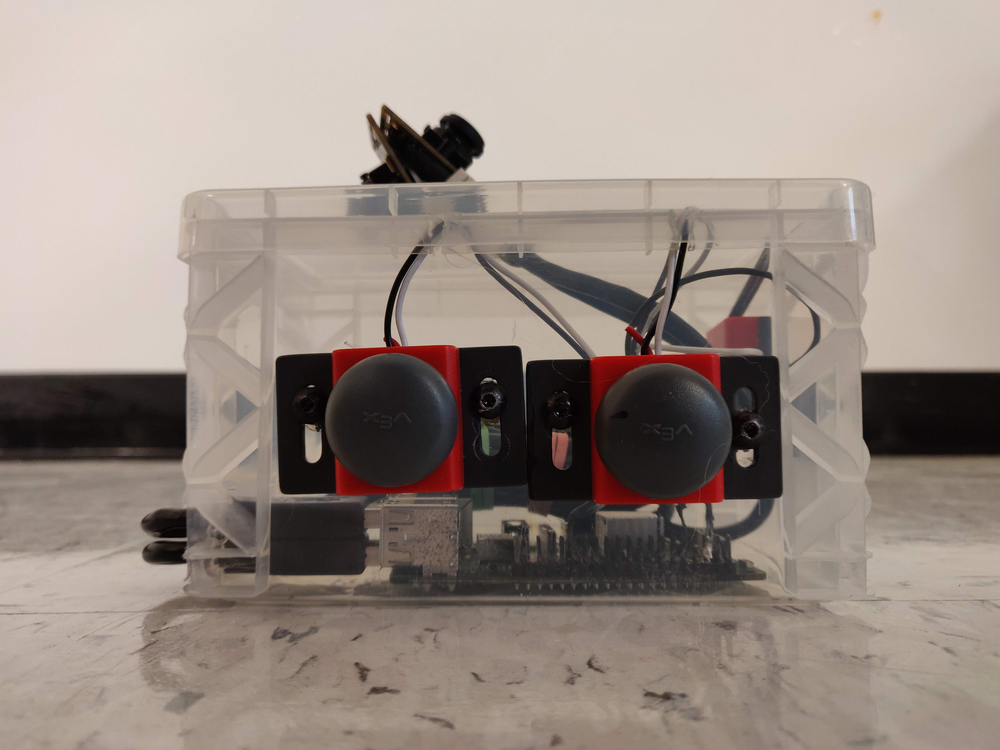

# 360 Degree Camera
Raspberry Pi 3B+ 360 Degree Camera Prototype
    - Mateusz Przezdziecki, Kyle Chastain, Zainub Ahmed

This presentation was made for a showcase to engineers at Ameren Union Electric Company in St. Louis.

# Camera Part List
Material List:
- Raspberry Pi 3B+
- 2x ELP 180 Degree Fisheye Raspberry Pi 1080P H.264 Camera
- 2x Vex Buttons
- Vex Switch
- 10,000 mAh portable power bank

# Code Specifics
We coded locally on the Raspberry Pi using Pipenv virtual environment.
Libraries Used:
- RPi.GPIO: Used for assigning buttons to the correct pin.
- OpenCV: Used for capturing the camera video and processing the video.
- Time: Used to set delays
- Glob: Used to assign specific file names for each video file.
- Pathlib: Used for specifying locations to save and retrieve files.
- Gpiozero: Used to recognize a button press.
- Signal: Used to stall the program once a button is pressed.
- Bubprocess: Used to check the length of time a button is pressed.

Due to the lack in the Raspberry Pi processing power, out video output was restricted to a lower resolution and bitrate. We resorted to using .avi video encoder; it was the only one that would not crash the program. We ended up successfully capturing a live image that covered a 175 degrees field of view. This was left as two seperate .avi file that could be put into a program to stitch the videos together.
